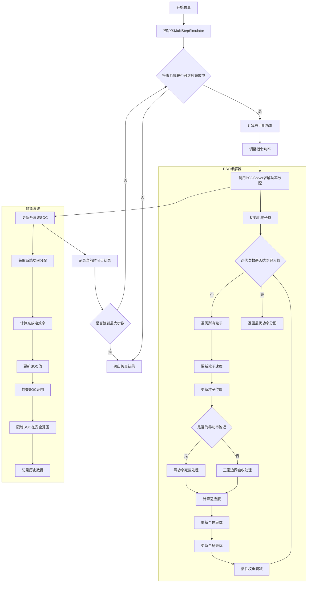

```mermaid
graph TD
    %% 整体仿真流程
    A[开始仿真] --> B[初始化MultiStepSimulator]
    B --> C{检查系统是否可继续充放电}
    C -->|是| D[计算总可用功率]
    D --> E[调整指令功率]
    E --> F[调用PSOSolver求解功率分配]
    F --> G[更新各系统SOC]
    G --> H[记录当前时间步结果]
    H --> I{是否达到最大步数}
    I -->|否| C
    I -->|是| J[输出仿真结果]
    C -->|否| J
    
    %% PSO求解流程
    subgraph PSO求解器
    F --> F1[初始化粒子群]
    F1 --> F2{迭代次数是否达到最大值}
    F2 -->|否| F3[遍历所有粒子]
    F3 --> F4[更新粒子速度]
    F4 --> F5[更新粒子位置]
    F5 --> F6{是否为零功率附近}
    F6 -->|是| F7[零功率死区处理]
    F6 -->|否| F8[正常边界吸收处理]
    F7 --> F9[计算适应度]
    F8 --> F9
    F9 --> F10[更新个体最优]
    F10 --> F11[更新全局最优]
    F11 --> F12[惯性权重衰减]
    F12 --> F2
    F2 -->|是| F13[返回最优功率分配]
    end
    
    %% 储能系统状态更新
    subgraph 储能系统
    G --> G1[获取系统功率分配]
    G1 --> G2[计算充放电效率]
    G2 --> G3[更新SOC值]
    G3 --> G4[检查SOC范围]
    G4 --> G5[限制SOC在安全范围]
    G5 --> G6[记录历史数据]
    end
```